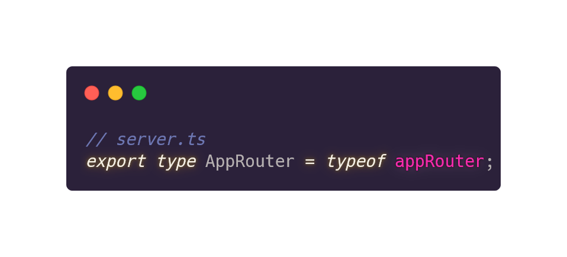
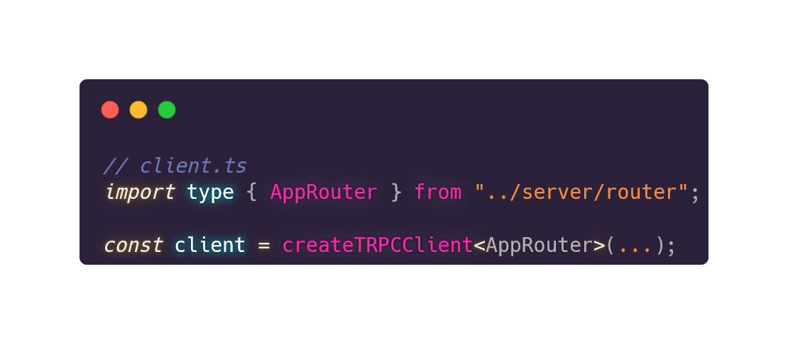

<!-- _class: lead gaia  -->
<!-- TRPC -->

**T**ypeScript **R**emote **P**rocedure **C**all

<!-- _footer: 'João Barreiros - @unstablectrl, July 2020' -->
<!-- _paginate: false -->

<!--
My name

been using this technology for almost a year

trpc can be described as
An alternative to traditional REST or GraphQL

let's take a look at why
-->

---

<!-- _class: lead gaia  -->
# REST

**RE**presentational **S**tate **T**ransfer

---
<!-- _footer: 'REST' -->
<!-- ## Rest -->

- verbs: GET, POST, PUT, PATCH, DELETE
- resource: USER, COMMENT, CATEGORY

to GET the USER with id 2
`GET https://website.com/api/user/2`

to DELETE the COMMENT with id 3
`DELETE https://website.com/api/comment/3`

---

to GET the COMMENTS from USER with id 2
`GET https://website.com/api/user/2/comments`

to GET the COMMENTS from USER with id 2
`GET https://website.com/api/comments?user=2`

to GET the COMMENTS from USER with id 2
`GET https://website.com/api/user/2?include=comments`

<!-- _footer: 'REST' -->

<!--
maybe you are working with a frame work
how to build your endpoints

frontend you would need documentation for you api
-->
---
<!-- _class: lead gaia  -->

**Graph** **Q**uery **L**anguage

---

What does GraphQL tries to solve?

- Over-fetching
- Multiple requests for multiple resources
- Waterfall network requests on nested data
- Each client need to know the location of each service

<!-- _footer: 'GraphQL' -->

<!--
graphql is a schema and a language designed for you to in detail describe everything your backend can do and the shape of that data as a graph

graphql is rest with extra steps because for an architecture reason a team reason a design reason or for good reason you want to add things on top of rest to make it more complex but stricter and more powerful and dynamic
-->

---

*"the bad parts"*

- Generate a schema
- Generate the types from the schema
- Separates your backend from you frontend

<!-- _footer: 'GraphQL' -->

<!--
graphql is a schema and a language designed for you to in detail describe everything your backend can do and the shape of that data as a graph

graphql is rest with extra steps because for an architecture reason a team reason a design reason or for good reason you want to add things on top of rest to make it more complex but stricter and more powerful and dynamic
-->

---

<!-- _class: lead gaia  -->
# tRPC

**T**ypeScript **R**emote **P**rocedure **C**all

<!--

Create by Alex

Colin McDonnell
Created Zod & tRPC
-->
---

**Alex "KATT" Johansson** (left)
Creator of tRPC

**Colin McDonnell** (right)
Creator of Zod & tRPC

<!-- _footer: 'tRPC' -->

<!--
Katt created trpc based on a proof of concept that colin had wrote

Zod is a TypeScript-first schema validation with static type inference

so what is tRPC and what does it look like
-->
---

<!-- _footer: 'tRPC' -->

<!--
trpc is a way to describe the things the backend can do and then call them remotely that's what the rpc stands for "remote procedure call".

It allows you to remotely call that backend code from the front end
-->

---

<!-- _class: lead gaia -->

# Type

...script
...safety
...checking
...inference

<!-- _footer: 'tRPC' -->

<!--
Goal is to deliver a better developer experience

Developed by Microsoft

Used by big players

Not going away any time soon
-->

---

<!-- _class: lead gaia -->

# let me  show you the magic

<!-- _footer: 'tRPC' -->

<!--
Here I show the end to end typesafety feature of tRPC
-->

---

<!-- _footer: 'tRPC' -->

---

A few things to consider

- Monorepo
- Testing
- Public APIs

<!-- _footer: 'tRPC' -->

---

## References

tRPC
<https://trpc.io>

Typescript
<https://www.typescriptlang.org>

Zod
<https://zod.dev>

React Query
<https://tanstack.com/query>

---

Create t3 App
<https://init.tips/>

GraphQL
<https://graphql.org/>

---

## Tools

Visual Studio Code
<https://code.visualstudio.com>

Marp - Create slides with Markdown
<https://marp.app>

Carbon - Create and share beautiful images of your source code
<https://carbon.now.sh>
