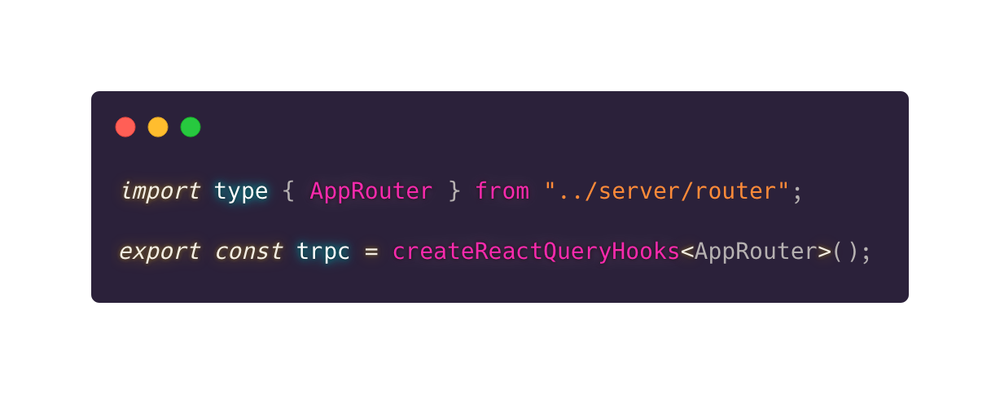

<!-- _class: lead gaia  -->
<!-- TRPC -->

**T**ypeScript **R**emote **P**rocedure **C**all

<!-- _footer: 'João Barreiros - @unstablectrl, July 2020' -->
<!-- _paginate: false -->

<!--
An alternative to traditional REST or GraphQL
-->

---

<!-- _class: lead gaia  -->
# REST

**RE**presentational **S**tate **T**ransfer

---

## Rest

- verbs:  GET, POST, PUT, PATCH, DELETE
- resource: USER, COMMENT, CATEGORY

to GET the USER with id 2 
`GET https://awsome-website.com/api/user/2`

to DELETE the COMMENT with id 3
`DELETE https://awsome-website.com/api/comment/3`

<!--
what is the verb: GET, POST, PUT, PATCH, DELETE
resource: user, product
-->

---

## GraphQl

- Over-fetching
- Multiple requests for multiple resources
- Waterfall network requests on nested data
- Each client need to know the location of each service

<!-- 
graphql is a schema and a language designed for you to in detail describe everything your backend can do and the shape of that data as a graph

graphql is rest with extra steps because for an architecture reason a team reason a design reason or for good reason you want to add things on top of rest to make it more complex but stricter and more powerful and dynamic
-->

---

"the bad parts"

- generate a schema
- generate the types from the schema

---

## Typescript

- type inference
- type checking

<!--
Goal is to deliver a better developer experience

Developed by Microsoft

Used by big players

Not going away any time soon
-->

---
 
<!-- _class: lead gaia  -->
# tRPC

**T**ypeScript **R**emote **P**rocedure **C**all

<!-- 

Create by Alex

Colin McDonnell
Created Zod & tRPC
-->
---

## tRPC

**Alex "KATT" Johansson** (left)
Creator of tRPC

**Colin McDonnell** (right)
Creator of Zod & tRPC

<!--
Katt created trpc based on a proof of concept that coling had wrote

Zod is a TypeScript-first schema validation with static type inference
-->
---

<!--
trpc is a way to describe the things the backend can do and then call them remotely that's what the rpc stands for "remote procedure call".

It allows you to remotely call that backend code from the front end
-->

---

<!-- _class: lead gaia -->

# Type

...script
...safety
...checking
...inference

---

<!-- _class: lead gaia -->

# let me  show you the magic

<!--
Here I show the end to end typesafety feature of tRPC
-->

---

---

## References

Typescript
<https://www.typescriptlang.org>

tRPC
<https://trpc.io>

React Query
<https://tanstack.com/query>

Zod
<https://zod.dev>

---

## Tools

Visual Studio Code
<https://code.visualstudio.com>

Marp - Create slides with Markdown
<https://marp.app>

Carbon - Create and share beautiful images of your source code
https://carbon.now.sh